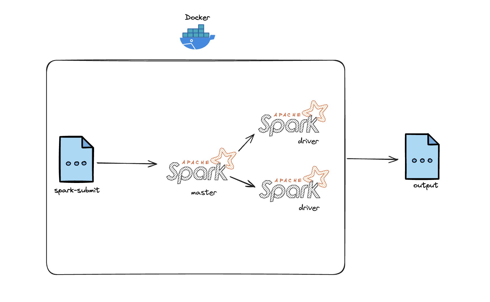

# Access Log Analyzer
Aplicação em que utiliza o Spark (Pyspark) para analisar logs de acesso de servidores web.

## Instruções de Instalação

- **Configuração do Ambiente:** Para garantir que o docker-compose funcione corretamente, é necessário configurar uma variável de ambiente no seu notebook. Execute o comando abaixo:
  ```bash
  export DOCKER_DEFAULT_PLATFORM=linux/amd64
  ```

- **Criação da Imagem do Container:** Para criar a imagem do container, execute o comando abaixo:
  ```
  docker build . -t zambotto-spark-3.4.0:v0.0.1
  ```

- **Importação do Arquivo de Log:** Após a criação da imagem, é necessário adicionar o arquivo `access_log.txt` dentro da pasta `scripts/work/data`. Este arquivo é o log de acesso que será analisado.

  **Observação**: O arquivo `access_log.txt` foi enviado no e-mail. Tentei fazer download dos arquivos via CURL e WGET, mas não consegui realizar a junção e extração dos arquivos `.7z`. Por isso,
utilize este arquivo.

## Instruções de Execução

- **Subir o Container:** Após a criação da imagem, execute o comando abaixo para subir o container:
  ```
  docker-compose up
  ```

- **Visualização das Análises:** As respostas das análises serão exibidas no console e também serão salvas no arquivo `output.txt` que estará dentro da pasta `scripts/work/output`. O parâmetro foi configurado no arquivo
`docker-compose.yaml`.

## Arquitetura

- **Imagem Docker**: A aplicação utiliza uma imagem Docker com o Spark 3.4.0 e Python 3.8.
- **Docker Compose**: Foi optado por utilizar o docker-compose.yaml para subir um CLUSTER Spark com 1 master, 2 workers e um outro container para execução do script python (spark-submit).


## Script Python

- **Análise de Log:** O script python criado é responsável por realizar a leitura do arquivo de log e realizar a contagem de acessos por IP. O script foi desenvolvido utilizando o Spark (Pyspark) e é executado dentro de um container Docker.
- **Uso de RDDs**: Optei por utilizar RDDs do Spark, pois acredito que seja mais performático para a análise de logs.
- **Armazenamento de Dados**: Por questão de ser uma análise exploratória, não optei por utilizar armazenamento de dados em banco de dados, mas sim, realizar a análise, salvar os resultados e exibir os resultados no console.